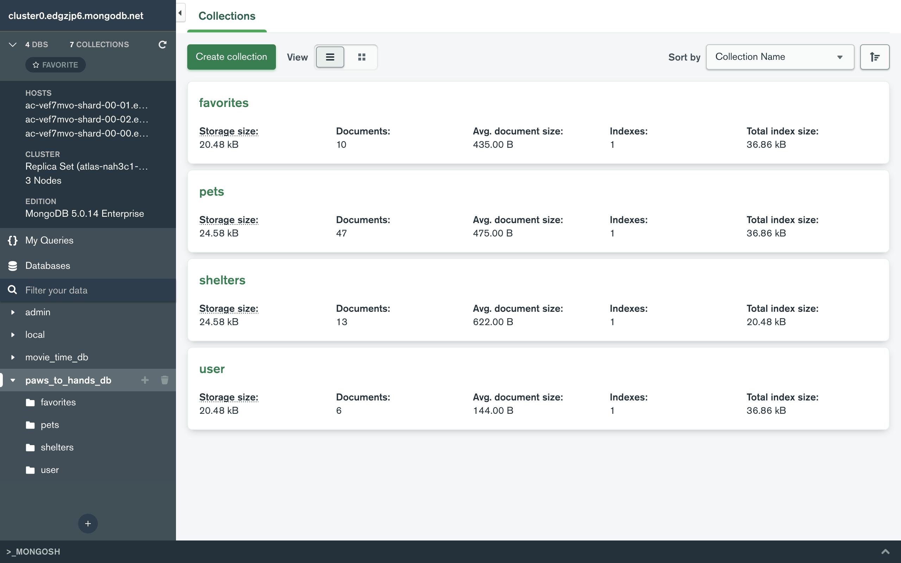
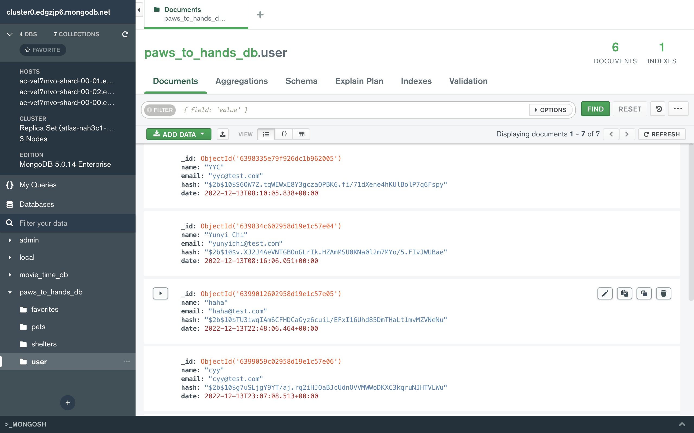
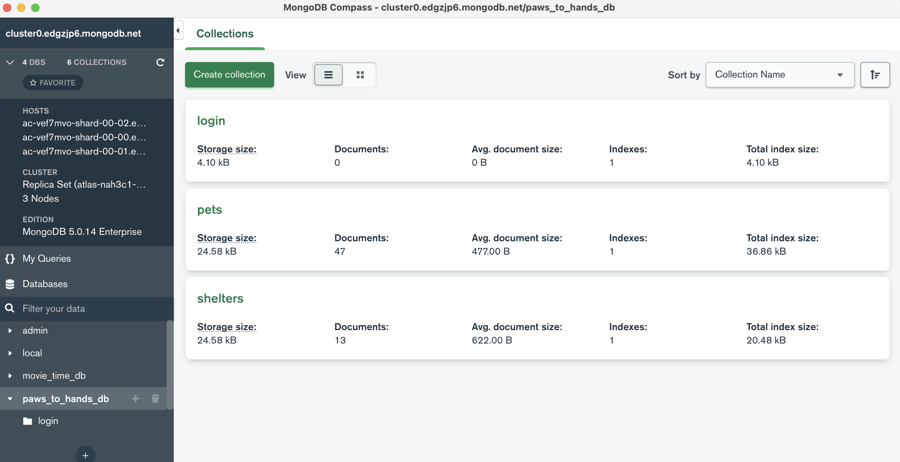
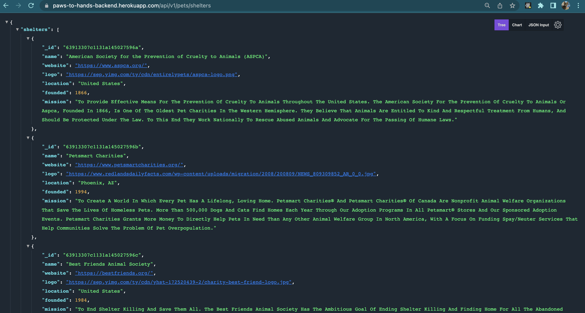
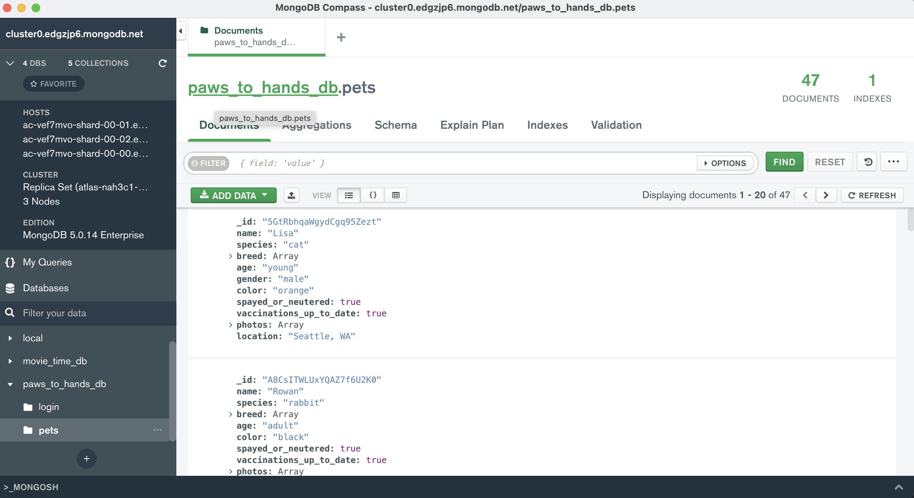
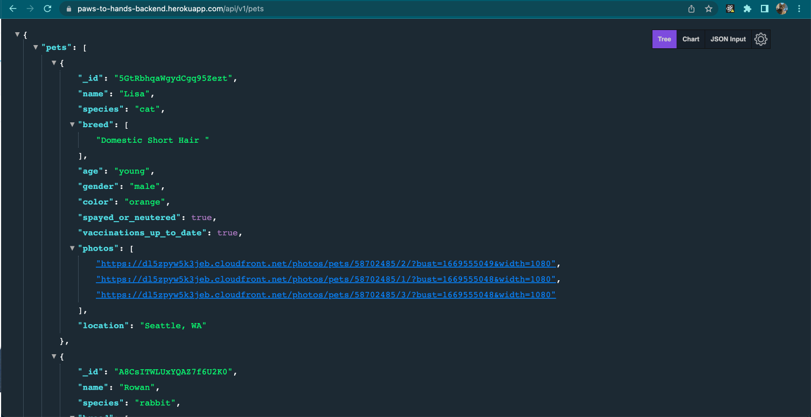

# Backend of PawsToHands

### Link to backend APIs:  
https://paws-to-hands-backend.herokuapp.com/

---
### Overview
* We have created a mongodb database `paws_to_hands_db`, which contains 4 collections.
* For `pets` and `shelters` collections, we have read operations.
* For `user` collection, we have create operations.
* For `favorite` collection, we have read and update operations.

---

## iter #3

## Task breakdown

Yunyi Chi
* Created 'user' collection in database, save user's login information.
* Added user route, user controller and userDAO for user authentication, Login and Register, encrypted user's password by bcrypt hashing.
* Finished favorite controller and favorite DAO.

Jiawei Liu

* Worked on favorite controller and favorite DAO.

Weixin Liu  

* Deployed to Heroku.

---
## iter #2

## Task breakdown

Weixin Liu  

* Created shelters collection in paws_to_hands_db.

* Implemented the backend, added routes and api and dao for getting shelters. 

* Deployed to Heroku.
---

## iter #1

## Task breakdown

Weixin Liu  

* Created paws_to_hands_db on Atlas.  

* Implemented the backend, including getting routes, pets controller, and pets DAO.  

* Deployed to Heroku.

Yunyi Chi
* Added getPetsBySpecies function.

