# Frontend of PawsToHands

Link to the backend page  
https://github.com/yunyichi/PawsToHands-backend

----
## Overview
This project displays animals that need a home and a new owner and provides the respectful data of these animals such as names, sex, age, breed, health, photos. 

A list of pets cards are shown in our website by clicking navbar `pets`--`All Pets` or by clicking link of `Meet more` card.   
Users can also filter the pets by their species, like dog, by clicking navbar `pets`--`Dog` or by clicking dog species card of Home page.
By clicking in `View Details` on each pet card, users can view the details for each pet.

And our website presents some famous organizations for pets rescue in the `Shelters` page. If interested, users can check more information with the external link on each shelter card and filter the shelters cards by location.

We implemented `Register` and `Signin` functions for users. And after signing in, users can add pets to their favorite list, and view their favorite pets in the `Favorite` component.

If a user is a foster and want to find a adoptor for a pet, we provide a form on `I am a foster...` page. This component currently is only a frontend element and need to be improved. And maybe later we can develop a management system for reviewing the submitted data and publishing the reviewed infomation to the front desk.

---
## Screenshots

Screenshot of the Home page:  
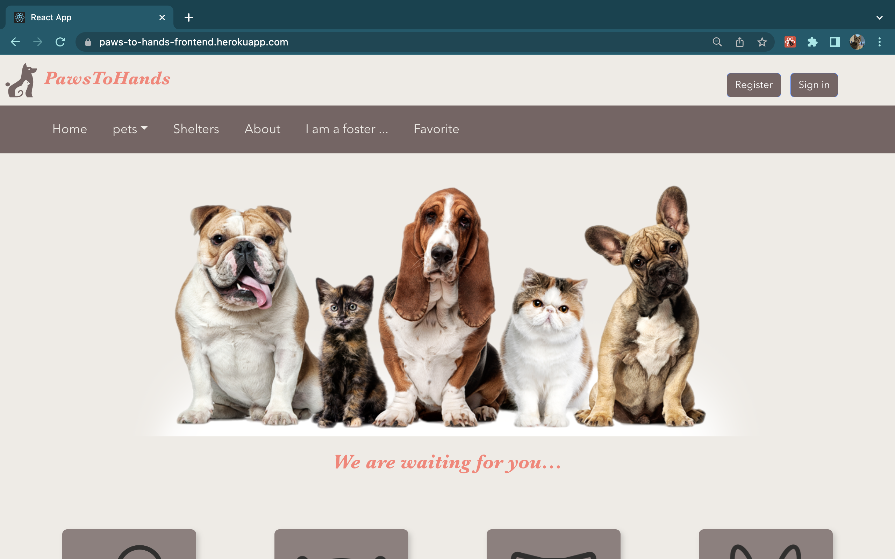
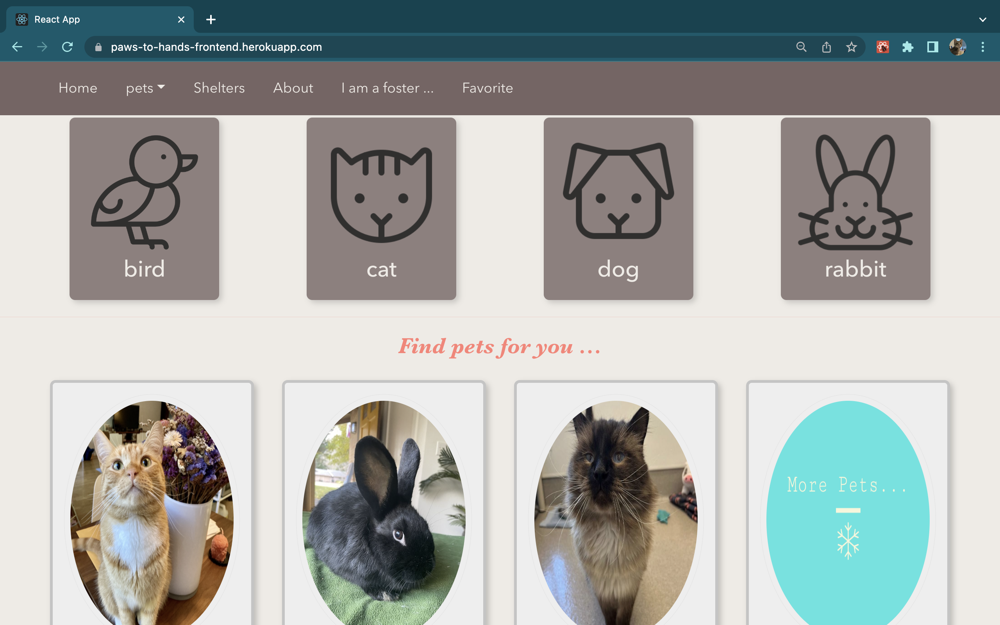

---

Screenshot of the Pets List page:  
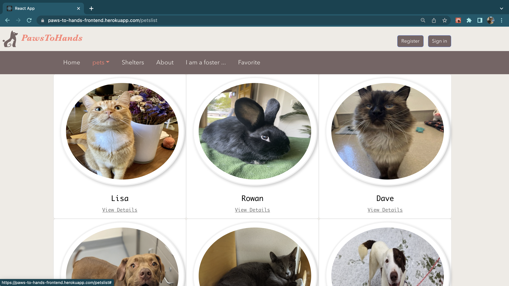
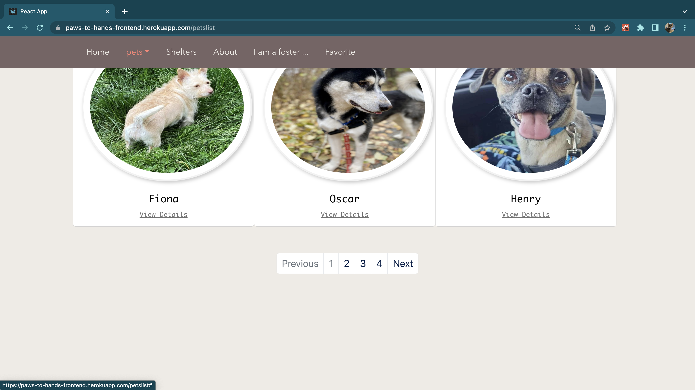

Screenshot of the Pet Detail page:  
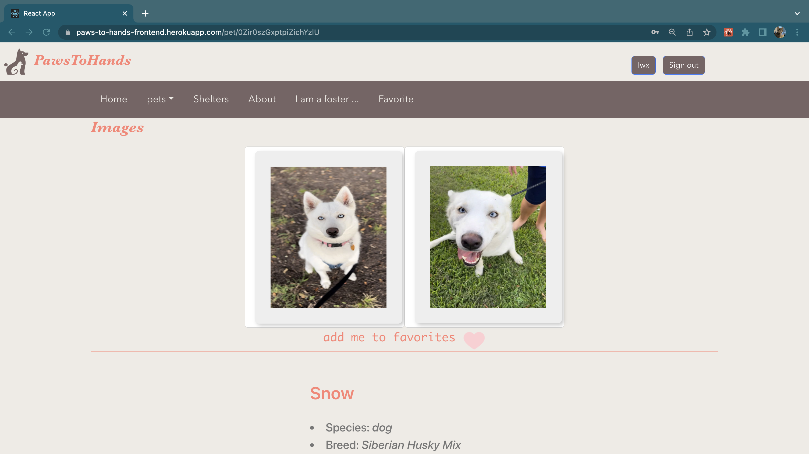

 ---

Screenshot of the Shelters page:  
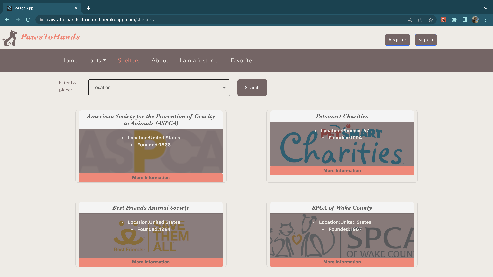

---

Screenshot of the About page:  
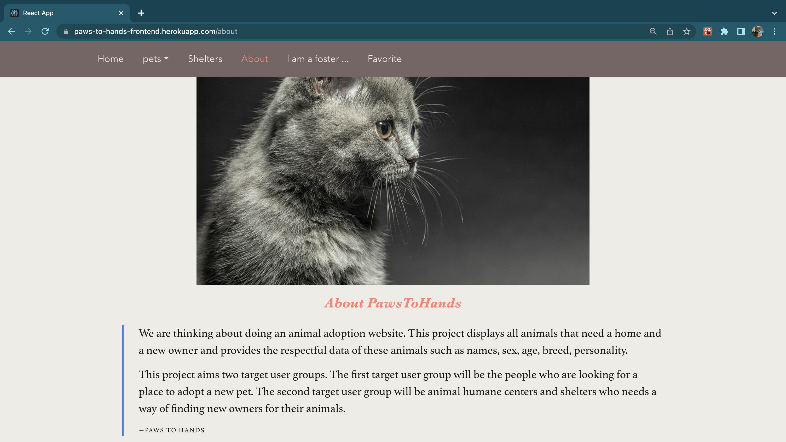

---

Screenshot of the Foster page:  
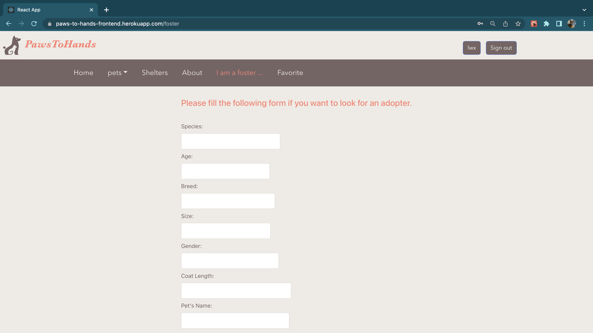

---

Screenshot of the Favorite page:   
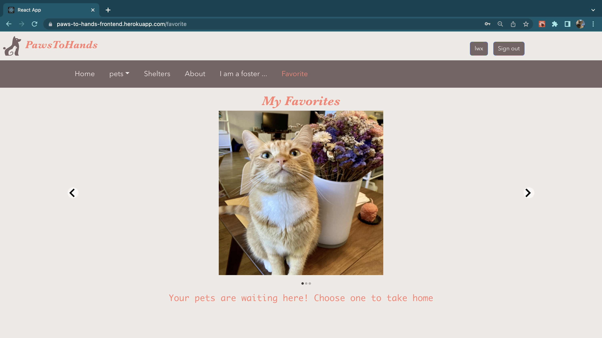

---

Screenshot of the register and sign in page:   
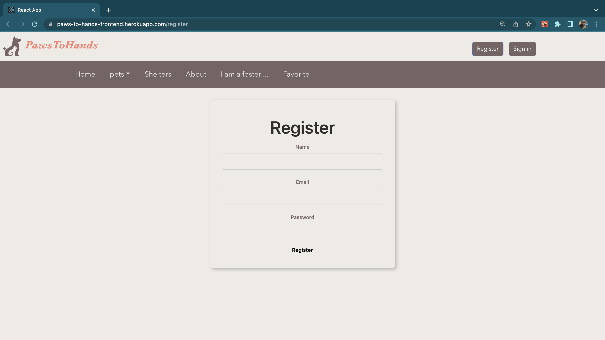

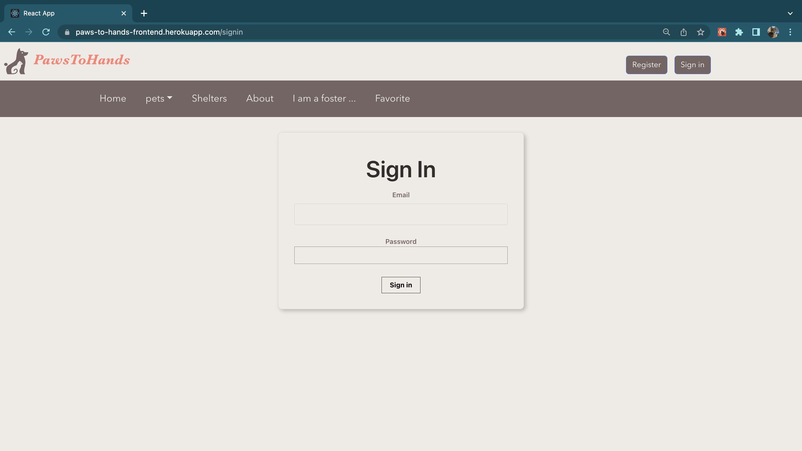
---

## Fulfillment of the project requirement
1. User interface with data by at least 2 CRUD operations (create, read, update, delete) for at least one database table:  
* We have created a mongodb database `paws_to_hands_db`, which contains 4 collections.
* For `pets` and `shelters` collections, we have read operations.
* For `user` collection, we have create operations.
* For `favorite` collection, we have read and update operations.

2. At least 3 different UI routes (appearing to the user as different pages):
* `Home`, `pets`, `shelters`, `About`, `I am a foster`, `Favorite`, `Register` and `Signin`.

3. At least one Bootstrap UI component not featured in the demo application
* NavDropdown

4. Different layout and design from the demo application; it should not look like an obvious clone
* We have different layout and design.

5. At least one of the following: 3rd party library for React;GraphQL interface to the database;Significant use of Redux for all state handling (instead of useState)
* 3rd Party Library we used:  
    Material UI (https://mui.com/) in `Shelters.js`  
    Tachyons (https://tachyons.io/)  
    react-mouse-particles
    react-slideshow-image

---

## Iter #3

## Task breakdown

Yunyi Chi
* Implemented user authentication pages and functionalities(register, signin), Interacted with backend api, rearranged route switching logic for logged in users
* Modified all cards layout.
* Add mouse particles animation
* Add pagination for petList Page.
* Finished Favorite component.

Jiawei Liu

* Implemented Foster component.
* Inplemented Favorite component.

Weixin Liu
* Fixed a bug on get pets by species.
* Embellished layout of pet details page and About page.
* Deloyed frontend to heroku.

---

## Iter #2

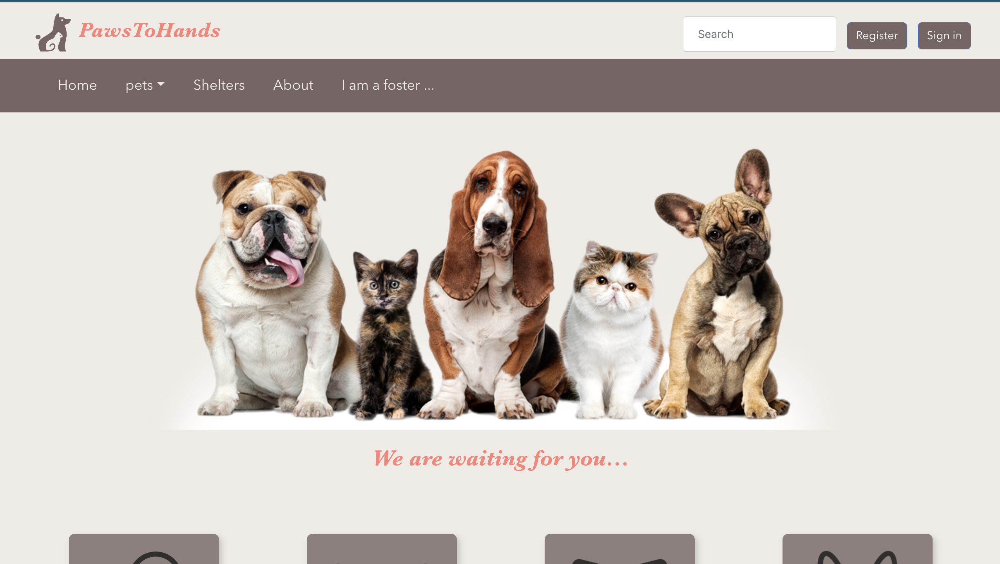
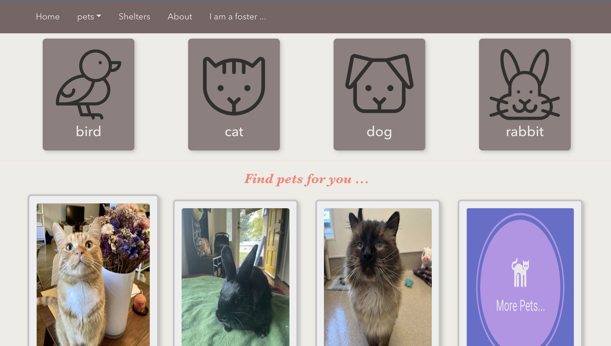

## Task breakdown
Yunyi Chi
* Fixed the layout of pets cards on the landing page.
* Implemented searching pets by species.
* Working on register and sign in components  
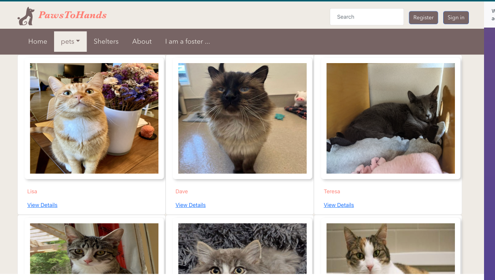
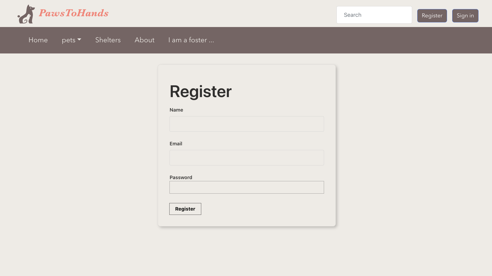

Jiawei Liu
* Working on favorite component

Weixin Liu
* Fixed the layout of navbar on the landing page
* Implemented shelters component
* Deloyed frontend to heroku  
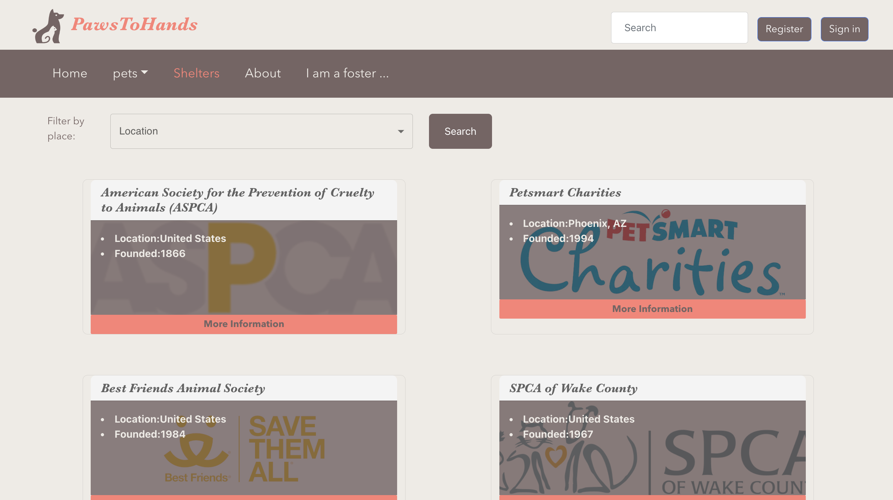

---

## Iter #1

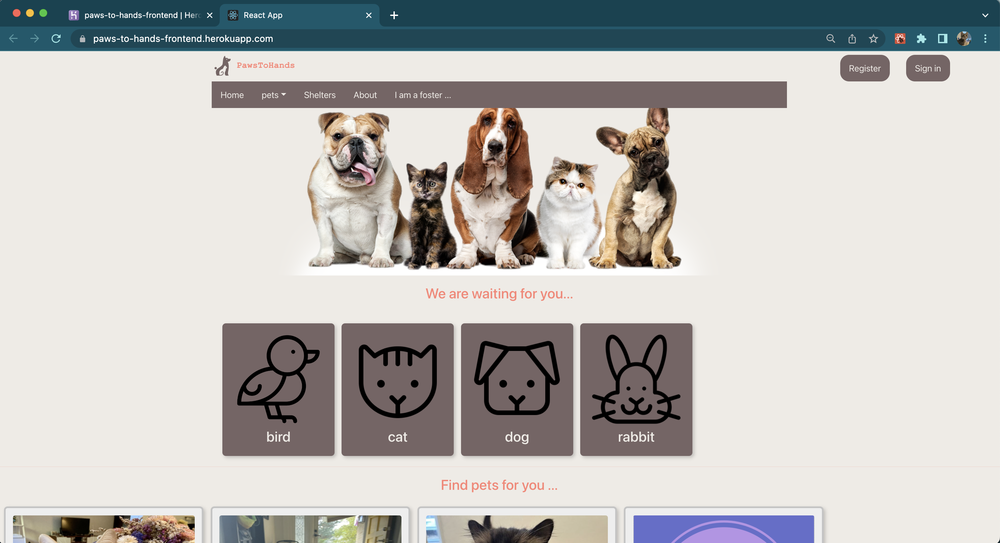

## Task breakdown
Yunyi Chi
* Initialized frontend  
* Implemented `App.js`, 
* Implemented components `Home`, `PetList`, `Pet`,`About`, `Register` and `Signin`  
 
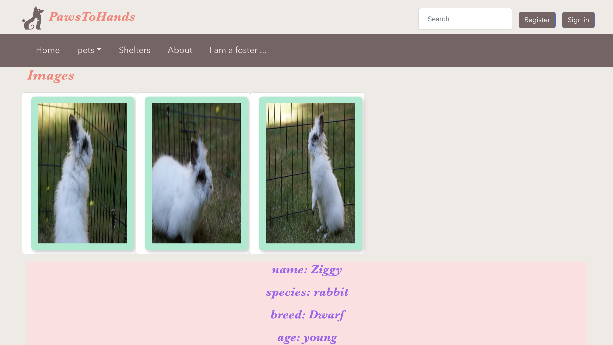 

Jiawei Liu
* Implemented components `Foster`, `Shelters`

Weixin Liu
* Structured project and package
* Modified homepage layout

