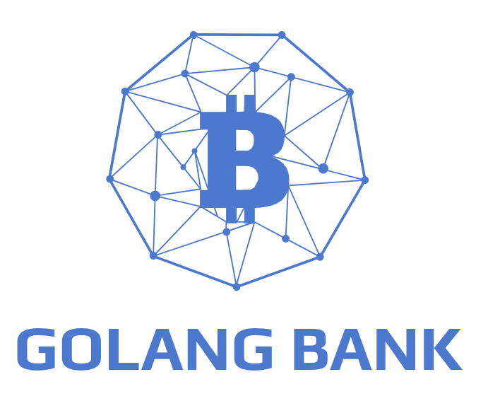

<!--
*** Thanks for checking out the Simple Bank Web Server README. If you have a suggestion
*** that would make this better, please fork the repo and create a pull request
*** or simply open an issue with the tag "enhancement".
*** Don't forget to give the project a star!
*** Thanks again! Now go create something AMAZING! :D
-->

<!-- PROJECT SHIELDS -->
<!--
*** I'm using markdown "reference style" links for readability.
*** Reference links are enclosed in brackets [ ] instead of parentheses ( ).
*** See the bottom of this document for the declaration of the reference variables
*** for contributors-url, forks-url, etc. This is an optional, concise syntax you may use.
*** https://www.markdownguide.org/basic-syntax/#reference-style-links
-->

<!-- PROJECT LOGO -->
 

  

  <h3 align="center">Simple Bank Web Server</h3>

  

    A robust Golang backend solution for banking applications, featuring a blend of RESTful APIs and gRPC services.
     
     
     
  

<!-- ABOUT THE PROJECT -->
## About The Project

The Simple Bank Web Server project is designed to provide a robust, secure, and scalable backend for banking applications, leveraging the power of Golang, PostgreSQL, and modern infrastructure technologies.

Key Features:
* Secure account creation, updates, and money transfers through RESTful APIs and gRPC services.
* Advanced PostgreSQL schema with optimized transactions to ensure data consistency and zero deadlocks.
* Comprehensive unit testing and integration with CI/CD pipelines for streamlined deployment and maintenance.

(<a href="#readme-top">back to top</a>)

### Built With

This section lists the major frameworks and technologies used in the development of the Simple Bank Web Server:

* [Golang](https://golang.org/)
* [PostgreSQL](https://www.postgresql.org/)
* [Docker](https://www.docker.com/)
* [AWS EKS](https://aws.amazon.com/eks/)
* [Gin](https://gin-gonic.com/)
* [gRPC](https://grpc.io/)
* [Redis](https://redis.io/)
* [Asynq](https://github.com/hibiken/asynq)

(<a href="#readme-top">back to top</a>)

## Usage

The Simple Bank Web Server supports various banking operations:

* Account creation and management
* Secure money transfers
* User authentication and authorization

(<a href="#readme-top">back to top</a>)

<!-- ROADMAP -->

